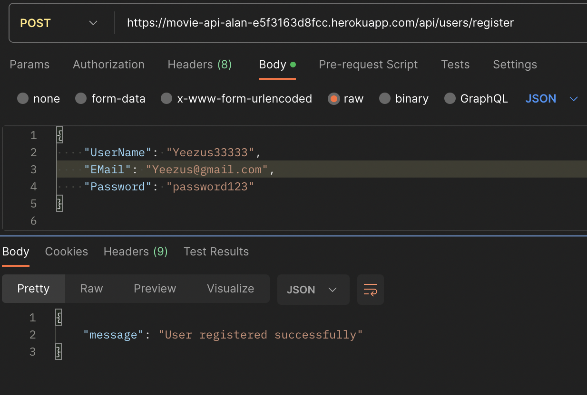

# Movie Database API - ReadMe

### Description

API for a movie database. It allows users to interact with a large amount of data about movies, including images, details, and other relevant information. The API is built with Express, Heroku, and Cloudinary and has a number of endpoints to fetch movie details as well as user-related operations.

### Inspiration
 Inspiration was drawn from sites like [Film Grab](https://film-grab.com/) and [Shot Cafe](https://shot.cafe/), which focus on displaying movie stills.

 To achieve this, I made a custom database by web scraping similar sites to gather high-quality movie images, I also used the Movie Database API from Rapid API to grab more detailed information about each movie.


### Endpoints
#### Movie Endpoints

### [GET /movies](https://movie-api-alan-e5f3163d8fcc.herokuapp.com/api/movies)
```
Fetches all the movies in the database.
Controller used: getMovies
```

### [GET movies/:id](https://movie-api-alan-e5f3163d8fcc.herokuapp.com/api/movies/64bfdda4fcd343bbd633807a)


```
Fetches a specific movie by its ID.
Controller used: getMovieById

```
### [GET movives/year/:year](https://movie-api-alan-e5f3163d8fcc.herokuapp.com/api/movies/year/2003)
```
Fetches all movies released in a specific year.
Controller used: getMoviesByYear
```
### [GET movies/genre/:genre](https://movie-api-alan-e5f3163d8fcc.herokuapp.com/api/movies/genre/Comedy)
```
Fetches all movies of a specific genre.
Controller used: getMoviesByGenre
```
### [GET movies/country/:country](https://movie-api-alan-e5f3163d8fcc.herokuapp.com/api/movies/country/United%20States)
```
Fetches all movies from a specific country.
Controller used: getMoviesByCountry
```
### [GET movies/stills/imdb/:id](https://movie-api-alan-e5f3163d8fcc.herokuapp.com/api/movies/stills/64bfdda4fcd343bbd633807a)
```
Fetches movie stills for a specific movie by its IMDB ID.
Controller used: getMovieStillsByIMDB
```
### [GET movies/stills/:id](https://movie-api-alan-e5f3163d8fcc.herokuapp.com/api/movies/stills/imdb/tt1019452)
```
Fetches movie stills for a specific movie by its ID.
Controller used: getMovieStillsByID
```
### [GET /poster/:id](/movies/poster/64bfdda4fcd343bbd633807a)
```
Fetches the movie poster for a specific movie by its ID.
Controller used: getPosterByID
```
#### User Endpoints



```
POST /register
Registers a new user.
Controller used: registerUser
```

### [GET /users](https://movie-api-alan-e5f3163d8fcc.herokuapp.com/api/users)
```
Fetches all users.
Controller used: getUsers
```

```
DELETE /:_id
Deletes a specific user by its ID.
Controller used: deleteUserById
```

```
PATCH /:_id/favorites
Updates the favorites for a specific user by its ID.
Controller used: updateUserFavoritesById
```


